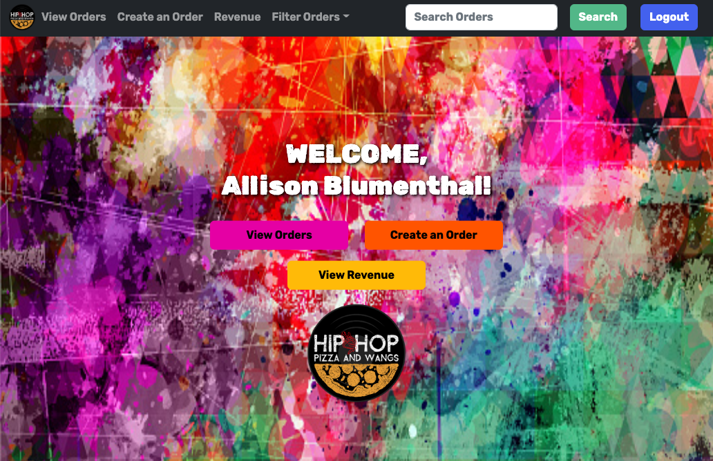
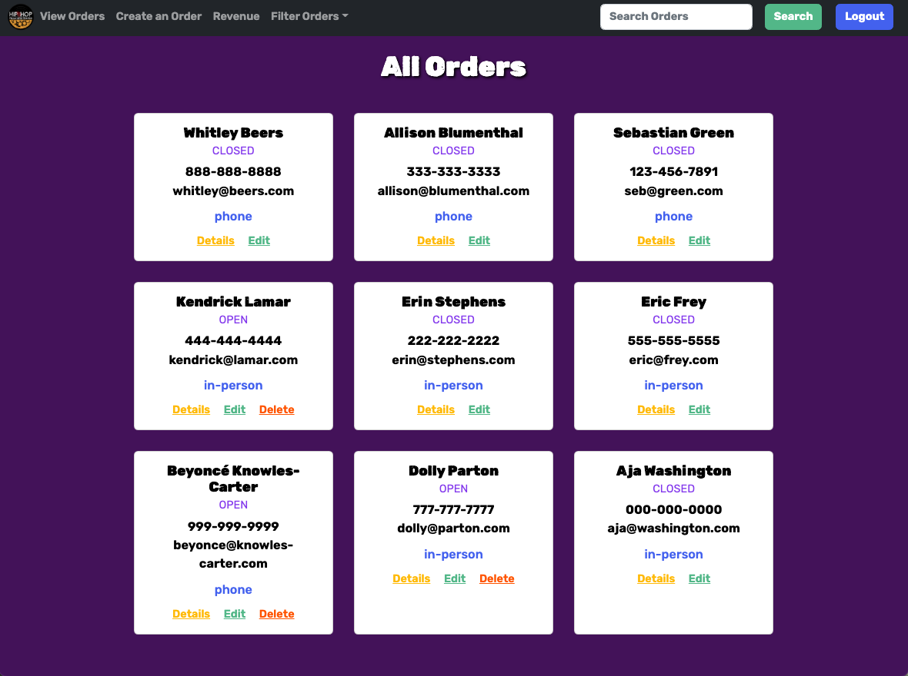
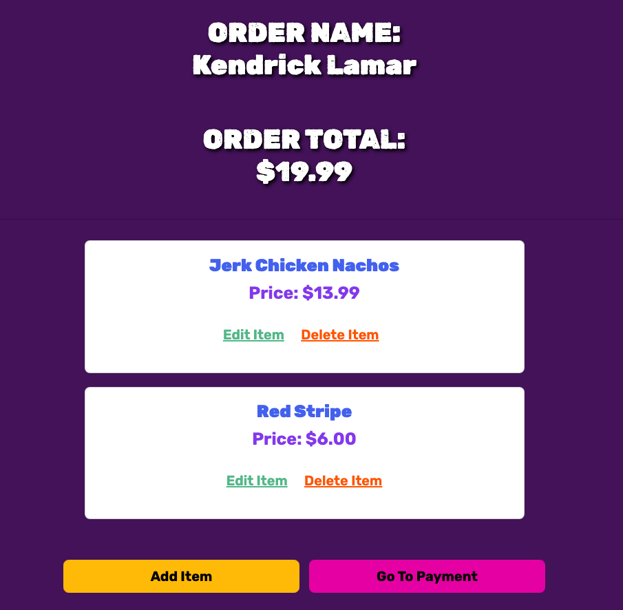
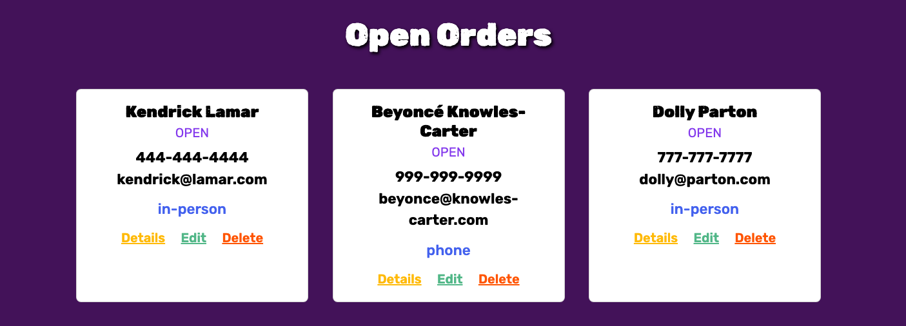
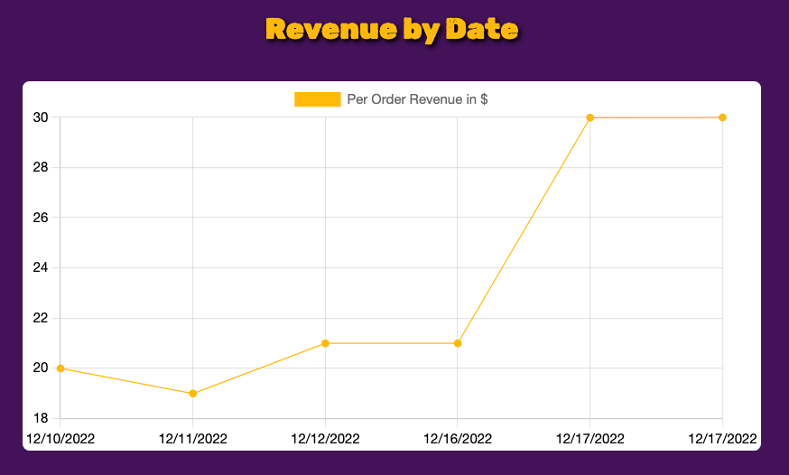

# Hip Hop, Pizza, and Wangs [](https://app.netlify.com/sites/hhpw-awee/deploys)
<!-- update the netlify badge above with your own badge that you can find at netlify under settings/general#status-badges -->

In this project, we created a website for a resturant POS. 

[View App](https://hhpw-awee.netlify.app/)

## Get Started
```
$ git clone git@github.com:nss-evening-cohort-21/pos-system-awee.git

$ cd pos-sytem-awee
```

## About the User 
- The ideal user for this application is a restuarant
- The business is slowly growing and they are ready to take on more orders with a computerized system. It will help keep them organized and efficient.
- The problem this app solves for them is it allows them to organize their different orders, edit the orders and the items in them. It also calculates the revenue for the restaurant.

## Features 
- When a new order is created, it will be added to the database and printed to the DOM with the current orders.
- Orders can be edited and items added to the orders. Items will be added to the database and printed in the order details. 
- Item amounts are added to the total revenue of each order. Total revenue of all order items is shown on separate page.

## Video Walkthrough of APP NAME
https://www.loom.com/share/a5c21fbbba6347619034935b461fa7ca

## Relevant Links <!-- Link to all the things that are required outside of the ones that have their own section -->
- [Check out the deployed site](https://hhpw-awee.netlify.app/)
- [Wireframe/Flowchart](https://www.figma.com/file/0WBbI9X6nxhNNrz6Sb3YxQ/Team-AWEE?node-id=0%3A1&t=Ir1OJ4QSX9n97gvK-0)
- [ERD](https://dbdiagram.io/d/638fe1c8bae3ed7c45453109)

## Code Snippet 
```
    if (e.target.id.includes('submit-item')) {
      const [, firebaseKey] = e.target.id.split('--');
      const payload = {
        itemName: document.querySelector('#itemName').value,
        price: document.querySelector('#itemPrice').value,
        orderID: firebaseKey
      };

      postItem(payload).then(({ name }) => {
        const patchPayload = { firebaseKey: name };

        patchItem(patchPayload).then(() => {
          getOrderDetails(firebaseKey).then((arr) => {
            getSingleOrder(firebaseKey).then((obj) => {
              viewOrderDetails(obj, arr);
```

## Project Screenshots







## Contributors
- [Allison Blumenthal](https://github.com/allison-blumenthal)
- [Eric Frey](https://github.com/ericlfrey)
- [Erin Stephens](https://github.com/erin-stephens)
- [Whitley Beers](https://github.com/WhitleyBeers)
